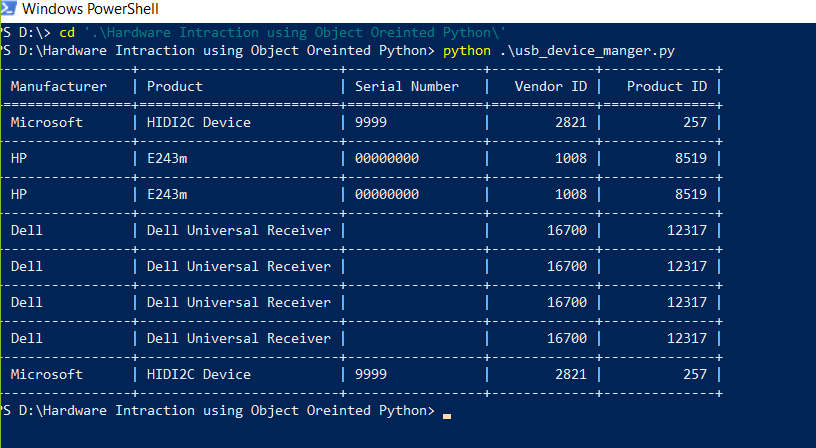

# USB Device Manager

This Python script allows you to list USB devices connected to your system(windows operating systems) and print the product name, Manufacturer, Serial number, Vendor ID and product ID in Tabular Format.

## Prerequisites
- Windows Operating System
- Python 3.X and above
- pywinusb and tabulate library

Install the required libraries using pip:

```bash
pip install pywinusb tabulate
```

## Script Output



